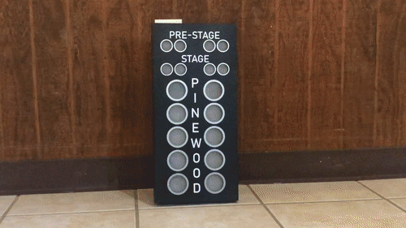

# DragStripChristmasTree_PicoW

During Maker Alliance Summer camp we built a Pinewood Derby track for a local Cub Scout pack. As an added bonus, we also made them this drag racing "Christmas Tree" light set to use on race day.  Happy Racing Scouts!

Hardware:  Raspberry Pi PICO W
WS2812b  light strings

Case template is included in the image directory

Thank you to Halbert Walston who stayed up all night to design, cut, assemble, and paint the case in time for race day! Thank you to all of the makers at Maker Alliance Summer Camp who gave us glue, screws, tools, and time to get this done before the local Boy Scout pack came to pick it up!

You can watch a how-to video [HERE](https://www.youtube.com/watch?v=jX-yiMg4pmQ)